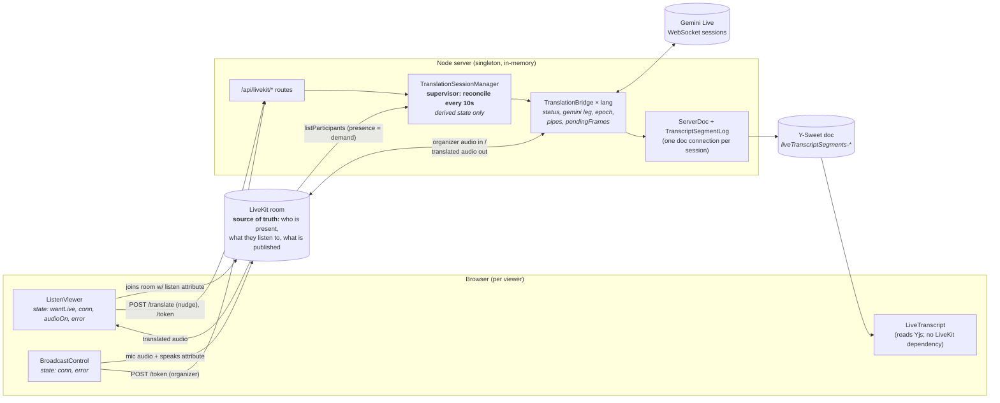
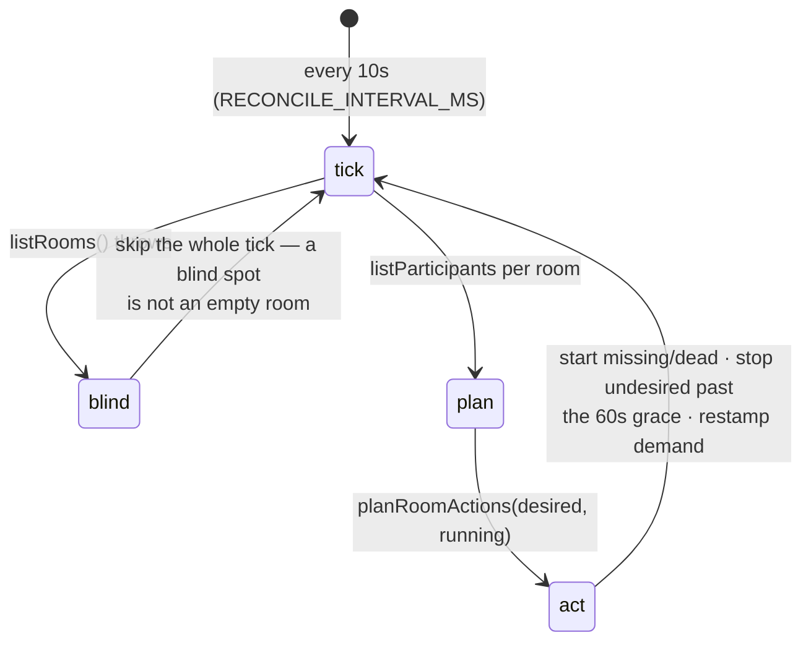
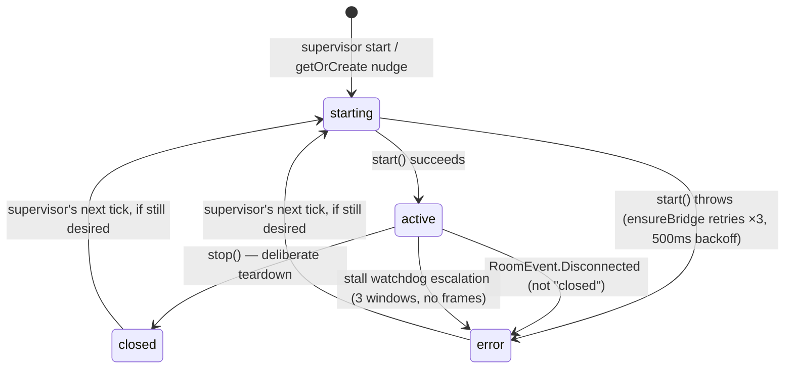
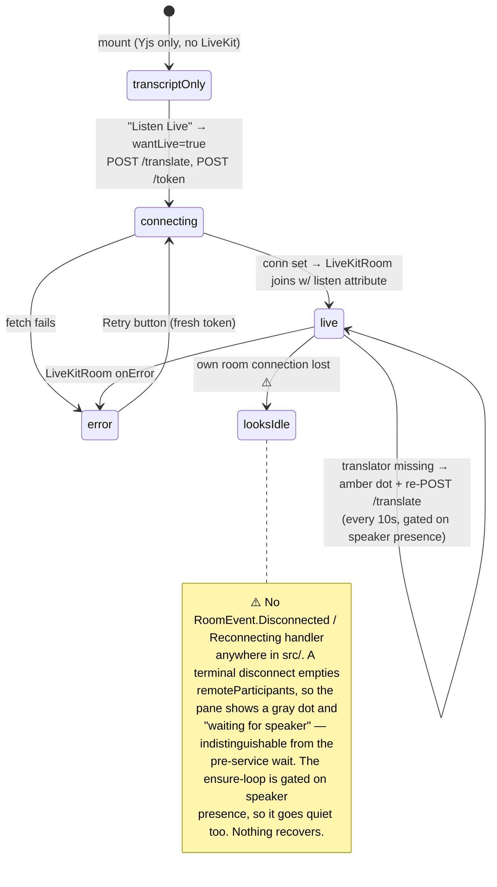
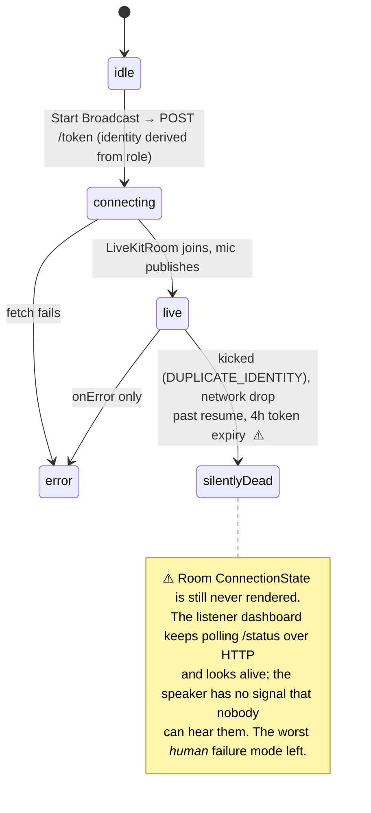
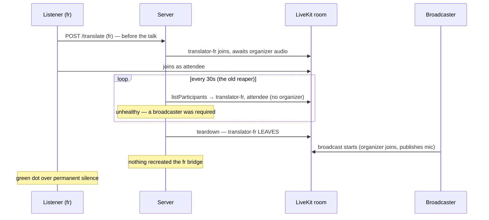

# Live translation: state architecture

Why the live-translation subsystem kept producing new state bugs, the principle that fixed
it, the architecture that principle became, and what it still doesn't cover.

This began (2026-07) as an audit and a proposal. Most of the proposal has since been built,
so the document is now a description of the system with its incident history attached rather
than a plan. The parts that are still open are collected in [What's still open](#whats-still-open)
— that list is short and deliberately honest; everything above it is claims about code you
can go read.

Companion to [live-audio-resilience.md](live-audio-resilience.md), which covers the three
outages on the bridge's *input* side in upstreamable detail. This document zooms out to
every other layer.

## The thesis

The bridge's input side was fixed with a principle: **don't store a decision made from an
event; reconcile against current state, and watch for the invariant breaking.** It was first
applied to exactly one edge — "is the bridge subscribed to the organizer's mic?" — because
that is where the outages happened to land.

The audit's finding was that every *other* piece of live-translation state was still managed
the pre-outage way, and that this explained why fixing one incident kept revealing the next:
the bugs were not independent, they were the same shape recurring in each unreconciled layer.

The fix was to apply the principle everywhere, with **LiveKit room presence as the single
source of truth** for what should be running. Where that state stands now:

| State | Where it lives | How it's maintained | Reconciled? | Watched? |
| --- | --- | --- | --- | --- |
| Bridge ↔ organizer-audio subscription | bridge | reconcile + stall watchdog (escalating) | ✅ | ✅ |
| Bridge lifecycle (`status`) | bridge + manager map | supervisor diffs desired vs running every 10s | ✅ | ✅ |
| Gemini socket leg | bridge | booleans + a teardown **epoch**; exposed as a derived enum | ⚠️ derived, not driven | ✅ |
| Which bridges should exist | supervisor | `computeDesiredLanguages` over room presence | ✅ | ✅ |
| Listener's connection to their translator | ListenViewer | ensure-loop on participant change + 10s tick | ✅ | ✅ presence only |
| Listener's own room connection | ListenViewer | `onError` only | ❌ | ❌ |
| Broadcaster's "am I live?" | BroadcastControl | `onError` only | ❌ | ❌ |
| Server ↔ Y-Sweet doc connection | `ServerDoc` | provider's own reconnect, unobserved | ❌ | ❌ |

Three of the four remaining ❌ rows are one residue: **a client's own connection to the room
is the state nobody reconciles.** What the server runs is now derived from presence and
recovers without being asked; a browser that falls out of the room still renders a plausible
idle screen and waits forever. The fourth (`ServerDoc`) is a genuinely unwatched server edge —
it has never been implicated in an outage, which is the only reason it is last. See
[What's still open](#whats-still-open).

## Component map and state ownership

The audit's central complaint was **four independent stores of "what should be running"**
(the manager's `subscriberCount`, its `translations` map, the LiveKit participant list, and
each client's `wantLive`), with nothing reconciling them. Three are gone as *stores*:

- `subscriberCount` is no longer a ledger. It is **recomputed each tick** from the count of
  participants carrying `listen: <language>`
  ([translation-session-manager.ts:766](../live-audio/translation-session-manager.ts#L766)),
  and it is display-only — nothing decides anything from it.
- The `translations` map is the *running* set, diffed against the desired set rather than
  consulted as truth.
- `wantLive` is now purely local: it means "this viewer opted into audio", and the way it
  reaches the server is by **joining the room with a `listen` attribute**, which is the same
  signal the supervisor reads. The client's intent and the server's view of it are the same
  fact, not two copies of it.

`POST /translate` still exists, but it is a *nudge* — a fast path so the pane can show a
translator identity without waiting up to 10s for the next tick. It stamps demand and
returns; it is not how the bridge stays alive.

## The state machines as actually implemented

### Server: the supervisor (the load-bearing loop)

Two pure functions carry the decision, so the whole policy is unit-testable without LiveKit:

- `computeDesiredLanguages(participants, …)` — a broadcaster must be present (no broadcaster,
  nothing desired); then the **primary target** (so a transcript is always being written, for
  free, whether or not anyone is listening) plus every distinct `listen` attribute in the
  room, minus the spoken language itself.
- `planRoomActions({desired, running, lastDesiredAt, now, stopGraceMs})` — **start** what is
  desired but missing *or present in a dead state* (`error`/`closed`), so start doubles as
  recreate; **stop** what has been undesired for longer than 60s.

The asymmetry that caused the worst outages is gone: this reconciler builds up as well as
tears down. Three details are load-bearing and easy to regress:

1. **A failed `listRooms` skips the tick.** Mistaking "can't see LiveKit" for "no rooms" would
   mass-teardown every live session at once.
2. **The stop grace (60s) is what makes transient blindness survivable.** `listParticipants`
   failing is treated as no visible demand, and only sustained absence stops anything.
3. **Source language is only recorded while a broadcaster is present.** An empty room's
   participant list would otherwise stamp the deployment default over a live session's
   declaration mid-talk.

### Server: bridge lifecycle

`error` rather than `closed` on an unexpected disconnect is the whole fix for the zombie
bridge ([translation-bridge.ts:666](../live-audio/translation-bridge.ts#L666)): `error` means
*recreatable*, `ensureBridge` cleans the entry up, and the supervisor starts a fresh one. The
Gemini side is torn down in the same handler, so a bridge can no longer linger holding a
paid-for session no audio will ever reach.

`start` attempts are rate-limited per language (`START_RETRY_MS`, 30s) so a language that
cannot start — a bad key, a quota wall — retries steadily instead of hammering every tick.

### Server: the Gemini leg

The five booleans and two nullable sockets are still the representation, but the two problems
they caused are closed from different directions:

- **Illegal states are unreachable by construction.** A **teardown epoch**
  ([translation-bridge.ts:414](../live-audio/translation-bridge.ts#L414)) is incremented on
  every stop, room failure, and silence suspend, and captured by each socket's handlers when
  wired. A handler whose epoch is stale is dropped instead of acting. This kills the entire
  "async callback fires in a state it wasn't written for" class — including the one that
  swapped a live, paid-for socket into a bridge that believed it had none.
- **The state is observable as one word.** `geminiLegState()` derives
  `ready | connecting | backoff | suspended | down` from the fields
  ([translation-bridge.ts:500](../live-audio/translation-bridge.ts#L500)), and `health()`
  returns it alongside `lastInputFrameAt`, `lastOutputFrameAt`, `reconnects`, and
  `bufferedFrames`. `status: "active"` — a single word that twice read healthy straight
  through an outage — is no longer the only thing a monitor can ask.

What the proposal asked for and did not get is the enum *driving* transitions rather than
being derived from them. The epoch made that much less urgent (it removes the bug class the
enum was meant to prevent), which is why it hasn't happened. The honest cost is that reading
the reconnect paths still means holding several fields in your head at once.

### Client: listener

The listener closes its own loop in two places, and it is worth being precise about which
failure each one covers:

- **Subscription** reconciles on every `remoteParticipants` change
  ([ListenViewer.tsx:128](../src/ListenViewer.tsx#L128)) rather than on track events. This is
  incidentally why attendees survived the 2026-07-12 outage that silenced every bridge: a
  LiveKit *full* reconnect replays `ParticipantConnected` and fires no `TrackPublished`, so
  an event-driven subscriber goes deaf and a presence-driven one does not. Same SDK, same
  options, opposite outcome — the lesson is written up in
  [live-audio-resilience.md](live-audio-resilience.md#failure-mode-2--the-full-reconnect-2026-07-12).
- **Bot existence** is re-requested every 10s while the speaker is present and our translator
  is not. This is the client-side mirror of the supervisor, and it is now a *backstop* rather
  than the primary mechanism — the supervisor gets there first in every case we know of. It
  earns its keep against server-side loss we haven't imagined yet.

The **speaker-presence gate on the ensure-loop** is not incidental: ungated, it churns
(request → wind down → request) through the entire pre-broadcast wait, fighting the
supervisor. Gated, the re-request fires exactly when demand becomes satisfiable, so it sticks.

The three-light dot (gray = no speaker, amber = speaker live but our bot missing, green =
wired) covers original-language listeners too: the audio is fine there, but a missing
transcript writer means half the pane is frozen, and green over frozen text is the reading
that leaves someone staring at a stale paragraph believing it is current. It is presence-based
only — it does not yet know whether audio is actually *flowing*.

### Client: broadcaster

The bridge side of a broadcaster rejoin is handled — a departing organizer's pipe is now
closed rather than left reading a dead stream, which was outage 3 ("fed twice", 2026-08-01).
The *browser* side is not: nothing tells the speaker their room connection died.

## Edge-case catalog

The audit's original table, with what each case does today. Kept in full because the closed
rows are the regression checklist: each one names a mechanism whose removal would reopen it.

| # | Trigger | Status | What happens now |
| --- | --- | --- | --- |
| 1 | Server restarts / redeploys mid-talk | ✅ | Supervisor's first tick reads LiveKit presence and rebuilds every desired bridge. Recovery is ≤10s and needs no client action. |
| 2 | Bridge's room `Disconnected` (node restart, duplicate identity, connectivity) | ✅ | `status = "error"` (recreatable), pipes closed, Gemini side torn down; supervisor restarts it. |
| 3 | `subscriberCount` drifts | ✅ | Gone as a concept. Recomputed from presence each tick, display-only. No beacon, no increments. |
| 4 | Stall watchdog reconciles in place forever | ✅ | Escalates: 3 consecutive stall windows with an apparently-live organizer and no frames marks the bridge `error`; the supervisor recreates it. |
| 5 | **Broadcaster kicked / disconnected** | ❌ | **Still silent.** No `ConnectionState` in `BroadcastControl`; speaker talks to nobody with no signal. |
| 6 | Two broadcaster tabs (or a reload race) | ⚠️ | Identity is derived from the role server-side (never client-chosen), so a second tab still takes the `organizer-host` seat and kicks the first. The *bridge* survives it cleanly now; the kicked *browser* is case #5. |
| 7 | Sole listener refreshes the page | ✅ | Leaving the room is the only unsubscribe signal, and the 60s stop grace outlasts a reload. No teardown/recreate race. |
| 8 | Suspend/stop races an in-flight `setupComplete` | ✅ | Epoch check drops the stale handler; the orphaned socket is closed instead of swapped in. |
| 9 | Transcript-only viewers, all audio listeners leave | ✅ | The primary target bridge is desired whenever a broadcaster is present, so the transcript keeps being written with zero listeners. |
| 10 | Long session, transcript append cost | ✅ | `TranscriptSegmentLog` appends into segments; the per-delta `ytext.toString()` scan of the whole day-scoped doc is gone. |
| 11 | 4h token TTL | ⚠️ | Still 4h ([server.ts:421](../server.ts#L421)). A full reconnect past it cannot complete. When the failure surfaces as `onError`, the listener's Retry button mints a fresh token and recovers (observed working in the field); when it surfaces as a plain disconnect, nothing surfaces at all. The broadcaster has no equivalent either way. |
| 12 | Y-Sweet websocket drop in a session's `ServerDoc` | ❌ | Unchanged. Provider reconnect is assumed, never observed; no health signal, no telemetry. |
| 13 | Listener opts in **before** the broadcast starts | ✅ | See the case study below. Closed three ways: the supervisor starts the bridge when the broadcaster appears, the client's gated ensure-loop backstops it, and the three-light dot shows amber rather than green while the bot is missing — so even the unfixed version would no longer *lie*. |

### Case study (2026-07-19, fixed): the waiting-room reap

Worth keeping because it is the clearest illustration of the thesis, and because the rule that
caused it is still in the code — `computeDesiredLanguages` returns an empty set with no
broadcaster present, exactly as `isSessionHealthy` did.

A French listener opts in before the broadcast starts. The translator bot joins, then leaves
~60–90s later; when the broadcast begins, the listener sits with a green "live" dot, hearing
and seeing nothing, indefinitely.

Two individually defensible rules composed into the outage:

1. "No broadcaster ⇒ nothing should be running" — a cost rule, and still the rule today.
   It classifies a waiting listener as unwanted demand, making the teardown *guaranteed*
   rather than a race.
2. Recreation did not exist. Nothing turned demand back into a running bridge.

The reaper *did* reconcile against ground truth — but it could only tear down. **A
one-directional reconciler converts every transient false negative in its health rule into a
permanent outage.** Rule 1 survived unchanged; making the reconciler bidirectional was the
entire fix. That is the generalizable lesson: the bug was never the health rule.

## What's still open

Ordered by user-visible payoff ÷ diff size. The first three are all in the browser, which is
the shape of what's left: the server reconciles and the clients mostly don't. All three are
small, and none needs a server change.

1. **Broadcaster connection banner** (~15 lines). Render `useConnectionState()` in
   `BroadcastControl`; anything but `Connected` gets an unmissable "NOT BROADCASTING" banner
   with a rejoin button. Closes #5, and turns #6 and #11 from silent failures into visible
   ones. This is the worst remaining *human* failure mode — a speaker nobody can hear — and
   the cheapest thing on the list.
2. **Listener disconnect handling** (~20 lines). Same gap, lower stakes: no
   `RoomEvent.Disconnected`/`Reconnecting` handling in `ListenViewer`, so a dropped listener
   sees "waiting for speaker" forever. Note that showing the state is not enough — recovery
   needs a *fresh token* (case #11 is exactly the reused-token failure), so the handler should
   clear `conn` and re-run the connect effect, which is what the existing Retry button does.
3. **Render `BridgeHealth`** (~10 lines). The server computes the composite snapshot and
   returns it in `TranslationInfo`; **nothing in `src/` reads it.** The broadcaster's dashboard
   still renders the single word `status`, which is precisely the signal that lied through two
   outages. The data is already on the wire.
4. **Observe the `ServerDoc` connection** (case #12). No health signal or telemetry on the
   server's own Y-Sweet link. Lowest confidence that it matters — it has never been implicated
   in an outage — but it is also the last completely unwatched edge.

Deliberately *not* on the list: driving the Gemini leg from a stored enum. The epoch closed
the bug class it was proposed to prevent, so what remains is a readability cost, not a
correctness one. Worth doing if that code needs substantial change for another reason; not
worth a dedicated rewrite.
